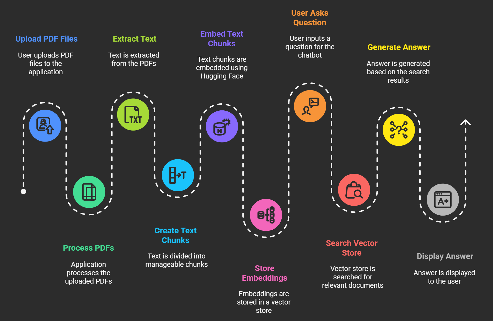

# 🧠 Chat with PDF 💬  
**An AI-powered chatbot that lets you upload PDFs, ask questions, and get instant answers or summaries.**

---

## 🌟 Overview  
Reading long PDF files like research papers, reports, or manuals can be time-consuming.  
**Chat with PDF** helps you **interact with your documents using natural language** — just like chatting with ChatGPT, but for your own files.

You can:
- 🗨️ **Ask questions** about your PDF content  
- 📄 **Summarize** lengthy documents automatically  
- 🎤 **Use voice input** to ask questions hands-free  

This app uses **LangChain**, **Hugging Face Transformers**, and **Streamlit**, running completely **on your local system**.

---

## 🧩 Features  
✅ Upload one or multiple PDF files  
✅ Automatically extract and chunk text  
✅ Generate embeddings using **HuggingFace MiniLM model**  
✅ Store document embeddings in a **FAISS vector database**  
✅ Ask natural language questions and get contextual answers  
✅ Generate concise summaries using **T5-small**  
✅ Use **microphone input** for voice-based questions  
✅ Works fully **offline** once models are downloaded  

---

## 🏗️ Architecture  

### 📊 Architecture Diagram  


### 🔄 Workflow Explanation  
1. **Upload PDF Files** → User uploads one or more PDFs.  
2. **Extract Text** → Text extracted using `PyPDF2`.  
3. **Create Text Chunks** → Split into smaller chunks (~500 words).  
4. **Embed Text Chunks** → Converted to numerical vectors using HuggingFace embeddings.  
5. **Store Embeddings** → Stored in a local FAISS vector store.  
6. **Ask Question** → User types or speaks a query.  
7. **Search Vector Store** → Finds the most relevant chunks.  
8. **Generate Answer** → Context passed to **Flan-T5 model** for response generation.  
9. **Display Answer** → The result or summary is shown on Streamlit UI.  

---

## 🛠️ Tech Stack  

| Component | Library / Tool | Purpose |
|------------|----------------|----------|
| **Frontend** | Streamlit | Interactive UI |
| **Text Extraction** | PyPDF2 | Extracts text from PDFs |
| **Embeddings** | HuggingFace `all-MiniLM-L6-v2` | Converts text to vectors |
| **Vector Store** | FAISS | Performs similarity search |
| **QA Model** | Flan-T5-small | Generates answers |
| **Summarization** | T5-small | Summarizes documents |
| **Voice Input** | SpeechRecognition | Converts speech to text |
| **Orchestration** | LangChain | Manages document–LLM interaction |
| **Parallelism** | ThreadPoolExecutor | Speeds up summarization |

---

## ⚙️ Setup and Installation  

### 🧾 Prerequisites  
- Python 3.8 or above  
- pip package manager  

### 📦 Steps to Run  
```bash
# 1. Clone the repository
git clone https://github.com/yourusername/chat-with-pdf.git
cd chat-with-pdf

# 2. (Optional) Create a virtual environment
python -m venv venv
# Activate it
# On Windows:
venv\Scripts\activate
# On Mac/Linux:
source venv/bin/activate

# 3. Install required dependencies
pip install -r requirements.txt

# 4. Run the Streamlit app
streamlit run app.py
